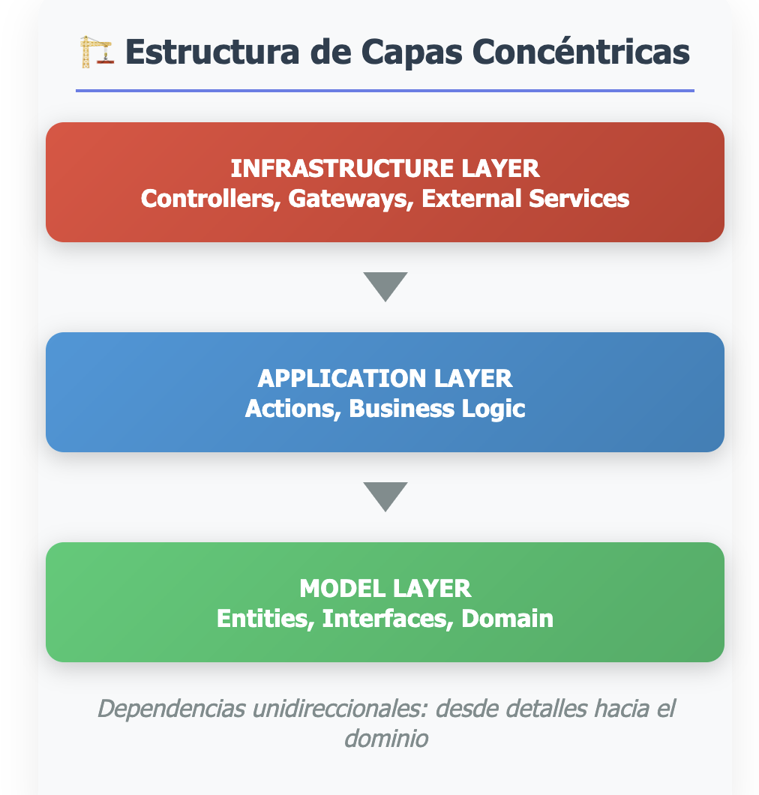
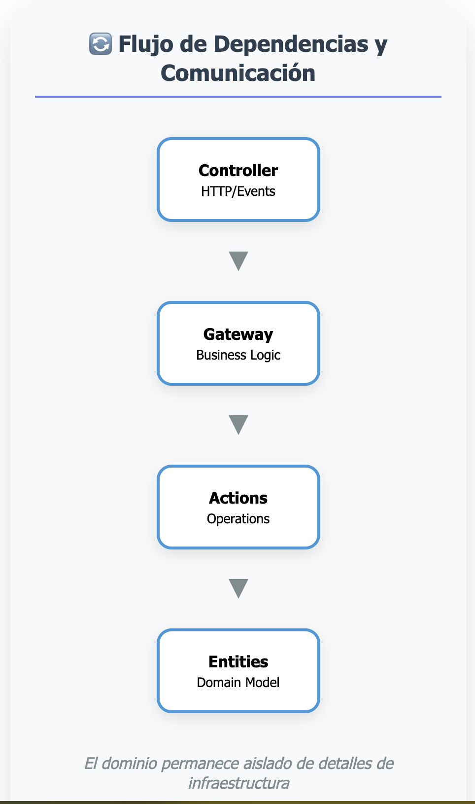
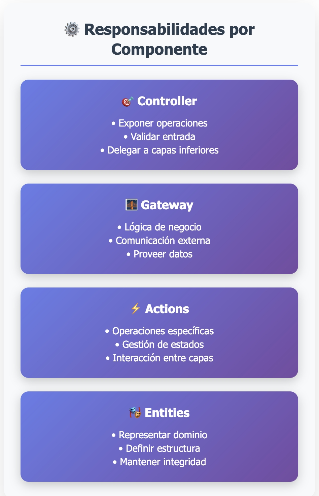
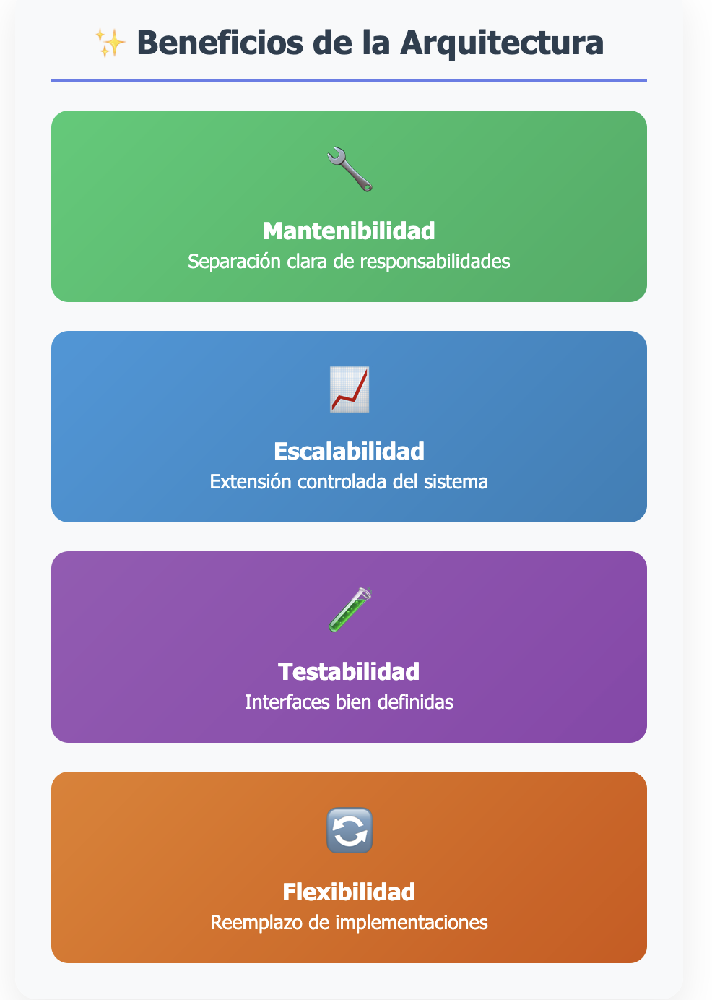

### Documentación General de la Arquitectura de Módulos

Cada módulo encapsula un conjunto coherente de funcionalidades, organizadas en capas concéntricas que definen dependencias unidireccionales: desde los detalles hacia el dominio.

La estructura busca mantener el dominio del negocio aislado de detalles de infraestructura como frameworks, bases de datos o servicios externos, favoreciendo una evolución controlada del sistema.



#### **Estructura del Módulo**
```
src/modules/<module-name>/
├── model/
│   ├── actions/
│   │   ├── I<ModuleName>Actions.ts
│   ├── entities/
│   │   ├── IEntity.ts
│   │   ├── IRelatedEntity.ts
├── application/
│   └── <ModuleName>Actions.ts
├── infrastructure/
│   ├── controller/
│   │   ├── <ModuleName>Controller.ts
│   │   ├── I<ModuleName>Controller.ts
│   │   └── __tests__/<ModuleName>Controller.test.ts
│   ├── gateways/
│   │   ├── <ModuleName>Gateway.ts
│   │   └── I<ModuleName>Gateway.ts
```

### **Componentes Principales**

<section>
  
  <p>Representa el flujo de datos desde el controlador hacia las capas internas del módulo.</p>
</section>

#### **1. Model Layer**
- **I<ModuleName>Actions.ts**  
  Define las interfaces para las acciones del módulo, estandarizando las operaciones disponibles.  
  **Responsabilidades:**
  - Estandarizar las operaciones del módulo.
  - Proveer una estructura clara para las acciones del módulo.

**Ejemplo:**
```typescript
import { ICard } from "../entities/ICard";

export interface IWalletActions {
    getters: IWalletGetters;
    setters: IWalletSetters;
    cardActions: IWalletCardActions;
    cashActions: IWalletCashActions; 
    enable: () => void;
    disable: () => void;
}
export interface IWalletSetters {
    setWalletBalance: (balance: number) => void;
    setWalletCards: (cards: ICard[]) => void;
    setDefaultCard: (cardId: string) => void;
    setIsEnabled: (isEnabled: boolean) => void;
}
export interface IWalletGetters {
    getWalletBalance: () => number;
    getWalletCards: () => ICard[];
    getDefaultCard: () => ICard | null;
    isWalletEnabled: () => boolean;
}
export interface IWalletCardActions {
    addCard: (card: ICard) => void;
    removeCard: (cardId: string) => void;
    updateCard: (cardId: string, updatedCard: Partial<ICard>) => void;
    setDefaultCard: (cardId: string) => void;
}
export interface IWalletCashActions {
    addCash: (amount: number) => void
    removeCash: (amount: number) => void;
}
```

- **IEntityA.ts**  
  Define la estructura de las entidades principales del módulo.  
  **Responsabilidades:**
  - Representar las propiedades y el estado de las entidades del módulo.

**Ejemplo:**
```typescript
export interface IWallet {
    id: string
    walletNumber?: string
    cash: number
    isEnabled: boolean
    associatedCards: ICard[]
}
```

---

#### **2. Application Layer**
- **<ModuleName>Actions.ts**  
  Este archivo define las acciones disponibles para interactuar con el módulo. Implementa la interfaz `I<ModuleName>Actions` y proporciona métodos para gestionar las operaciones principales del módulo.  
  **Responsabilidades:**
  - Realizar operaciones específicas del módulo.
  - Gestionar datos y estados relacionados con el módulo.
  - Proveer métodos para interactuar con otras capas del sistema.

**Ejemplo:**
```typescript
import { IWalletActions } from "../model/actions/IWalletActions";
import { IWallet } from "../model/entities/IWallet";

export const WalletActions: (wallet: IWallet) => IWalletActions = (wallet) => {
    return {
        getters: {
            getWalletBalance: () => wallet.cash,
            getWalletCards: () => wallet.associatedCards,
            getDefaultCard: () => wallet.associatedCards.find(card => card.isDefault) || null,
            isWalletEnabled: () => wallet.isEnabled
        },
        setters: {
            setWalletBalance: (balance: number) => {
                wallet.cash = balance;
            },
            setWalletCards: (cards) => {
                wallet.associatedCards = cards;
            },
            setDefaultCard: (cardId: string) => {
                const card = wallet.associatedCards.find(c => c.id === cardId);
                if (card) {
                    wallet.associatedCards.forEach(c => c.isDefault = false);
                    card.isDefault = true;
                } else {
                    throw new Error("Card not found");
                }
            },
            setIsEnabled: (isEnabled: boolean) => {
                wallet.isEnabled = isEnabled;
            }
        },
        cashActions: {
            addCash: (amount: number) => {
                wallet.cash + amount;
            },
            removeCash: (amount: number) => {
                if (wallet.cash >= amount) {
                    wallet.cash - amount
                } else {
                    throw new Error("Insufficient cash balance");
                }
            }
        },
        cardActions: {
            addCard: (card) => {
                wallet.associatedCards.push(card);
            },
            removeCard: (cardId: string) => {
                wallet.associatedCards = wallet.associatedCards.filter(c => c.id !== cardId);
            },
            updateCard: (cardId: string, updatedCard) => {
                wallet.associatedCards = wallet.associatedCards.map(card => {
                    if (card.id === cardId) return { ...card, ...updatedCard };
                    return card;
                })
            },
            setDefaultCard: (cardId:string) => {
                wallet.associatedCards = wallet.associatedCards?.map( card => {
                    if(card?.id === cardId) return { ...card, isDefault: true }
                    return { ...card, isDefault: false }
                })
            }
        },
        enable: () => {
            wallet.isEnabled = true;
        },
        disable: () => {
            wallet.isEnabled = false;
        }
    }
}
```

---

#### **3. Infrastructure Layer**
- **<ModuleName>Controller.ts**  
  Este archivo define los puntos de entrada para interactuar con el módulo, como endpoints HTTP o eventos. Implementa la interfaz `I<ModuleName>Controller` y delega la lógica de negocio a la capa de aplicación.  
  **Responsabilidades:**
  - Exponer las operaciones del módulo como servicios accesibles.
  - Validar los datos de entrada.
  - Delegar las operaciones a la capa de aplicación o gateways.

**Ejemplo:**
```typescript
import Elysia, { t } from "elysia";
import { IWalletGateway } from "../gateways/IWalletGateway";
import { WalletControllerRoutes, WalletDepositBody, WalletTransferBody, WalletWithdrawBody } from "./IWalletController";
import { WalletGateway } from "../gateways/WalletGateway";
import { apiPath } from "../../../../config";

const gateway: IWalletGateway = WalletGateway()

export const walletController = new Elysia()
	.group(`${apiPath}/wallet`, (app) => {
		return app
		.get(
			`${WalletControllerRoutes.BALANCE}/:userId`,
			async ({ params }) => {
				const { userId } = params;
				return await gateway.getBalance(userId);
			}
		)
	
		.post(
			WalletControllerRoutes.DEPOSIT,
			async ({ body }) => {
				try {
					const { userId, amount } = body;
					await gateway.deposit(userId, amount);
					return { message: "Deposit successful" };
				} catch (error) {
					console.error("Error during deposit:", error);
					return { message: "Deposit failed" };
				}
			},
			{
				body: WalletDepositBody
			}
		)
		.post(
			"/withdraw/:userId",
			async ({ params, body }) => {
				const { userId } = params;
				const { amount } = body;
				return await gateway.withdraw(userId, amount);
			},
			{
				body: WalletWithdrawBody
			}
		)
		.post(
			"/transfer",
			async ({ body }) => {
				const { fromUserId, toUserId, amount } = body;
				return await gateway.transfer(fromUserId, toUserId, amount);
			},
			{
				body: WalletTransferBody
			}
		)
		.get("/history/:userId", async ({ params }) => {
			const { userId } = params;
			return await gateway.getTransactionHistory(userId);
		});
	})
```

- **<ModuleName>Gateway.ts**  
  Este archivo actúa como intermediario entre el controlador y la lógica de negocio. Implementa la interfaz `I<ModuleName>Gateway` y puede interactuar con servicios externos o bases de datos.  
  **Responsabilidades:**
  - Implementar la lógica de negocio del módulo.
  - Manejar la comunicación con servicios externos o bases de datos.
  - Proveer datos al controlador.

**Ejemplo:**
```typescript
import { IWalletGateway } from "./IWalletGateway";

export const WalletGateway: () => IWalletGateway = () => {
    return {
        getBalance: async (userId: string): Promise<{balance: number}> => {
            try {
                const resBalance = await new Promise<{balance: number}>((resolve) => {
                    setTimeout(() => {
                        const balance = 1000;
                        resolve({balance});
                    }, 1000);
                });
                return resBalance;
            } catch (error) {
                console.error("Error fetching balance:", error);
                throw new Error("Failed to fetch balance");
            }
        },
        deposit: async (userId: string, amount: number): Promise<void> => {
            try {
                await new Promise<void>((resolve) => {
                    setTimeout(() => {
                        console.log(`Deposited ${amount} for user ${userId}`);
                        resolve();
                    }, 1000);
                });
            } catch (error) {
                console.error("Error depositing amount:", error);
                throw new Error("Failed to deposit amount");
            }
        },
        withdraw: async (userId: string, amount: number): Promise<void> => {
            try {
                await new Promise<void>((resolve) => {
                    setTimeout(() => {
                        console.log(`Withdrew ${amount} for user ${userId}`);
                        resolve();
                    }, 3000);
                });
            } catch (error) {
                console.error("Error withdrawing amount:", error);
                throw new Error("Failed to withdraw amount");
            }
        },
        transfer: async (fromUserId: string, toUserId: string, amount: number): Promise<void> => {
            try {
                await new Promise<void>((resolve) => {
                    setTimeout(() => {
                        console.log(`Transferred ${amount} from user ${fromUserId} to user ${toUserId}`);
                        resolve();
                    }, 4500);
                });
            } catch (error) {
                console.error("Error transferring amount:", error);
                throw new Error("Failed to transfer amount");
            }
        },
        getTransactionHistory: async (userId: string): Promise<Array<{ date: Date; amount: number; type: string }>> => {
            try {
                const history = await new Promise<Array<{ date: Date; amount: number; type: string }>>((resolve) => {
                    setTimeout(() => {
                        const transactions = [
                            { date: new Date(), amount: 100, type: "deposit" },
                            { date: new Date(), amount: 50, type: "withdraw" },
                        ];
                        resolve(transactions);
                    }, 2000);
                });
                return history;
            } catch (error) {
                console.error("Error fetching transaction history:", error);
                throw new Error("Failed to fetch transaction history");
            }
        }
    };
};

```

---

### **Extensibilidad**
La arquitectura está diseñada para ser extensible:
- Se pueden añadir nuevos puntos de entrada en `<ModuleName>Controller`.
- Las interfaces en `I<ModuleName>Actions` permiten agregar nuevas acciones sin afectar el resto del sistema.
- Los gateways pueden ser reemplazados por implementaciones reales que interactúen con bases de datos o servicios externos.

Esta estructura asegura una separación clara de responsabilidades, facilitando el mantenimiento y la escalabilidad del módulo.

### **Imágenes**

  
  
